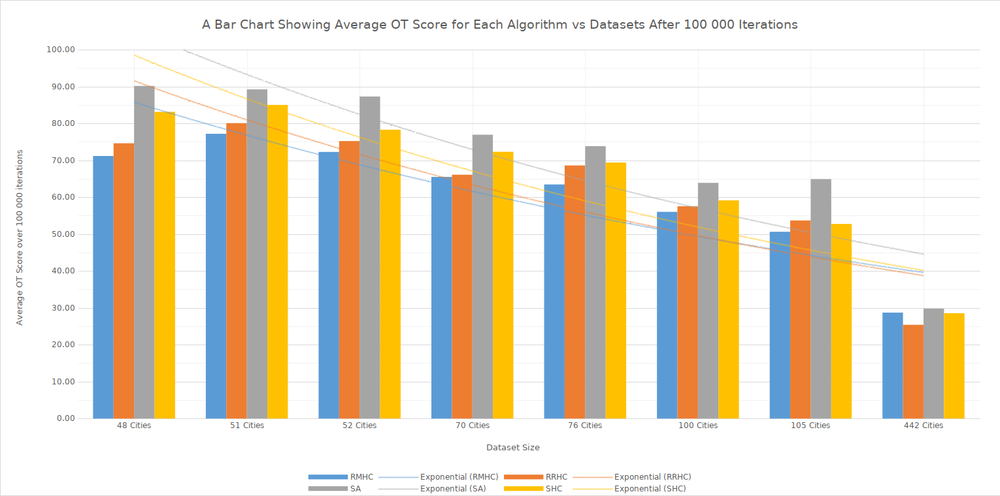

# Using Genetic Algorithms to 'solve' the Travelling Salesperson Problem

This repository serves as a store of my approach to solving the [Travelling Salesperson Problem](https://en.wikipedia.org/wiki/Travelling_salesman_problem) using a variety of known algorithms implemented in Java.

## Aim
The aim of the project was to repreoduce a series of solutions to the TSP from the field of heuristic and genetic algorithms. The project consists of a large dataset which represents the matrix of distances between all cities for a particular size of a problem space, the goal is to apply each alogrithm and determine which provides the most cost-efficient solution to the given probelm space.

The following algorithms are utilised in this experiment:
* Random Mutation Hill Climbing (RMHC)
* Random Restart Hill Climbing (RRHC)
* Stochastic Hill Climbing (SHC)
* Simulated Annealing (SA)

Each of the algorithms was applied to a problem space of varying size, the experiments were ran multiple times to remove operational outliers and provie an average performance for each of the solutions.  
A detailed documentation of results can be found in the corresponding spreadsheet file.

## Coice of Datasets
This experiment utilises 8 datasets from the given sample space of 48, 51, 52, 70, 76, 100, 105, and 442. City distance data files were loaded into the program and algorithms were ran on each dataset to test the algorithm's efficiency.

To compare the solution provided by the algorithm it was measured against an optimal route for a given problem space (saved in a n_OPT.txt) matrix. Using the optimal route it was possible to calculate the efficiency of the solution derived from the algorithm against the optimal possible route.

The datasets span from very small (48) to the largest available set (442) which allows for a demonstration of how each algorithm performs across varying problem spaces.

## Experimental Design
In order to determine how the algorithms perform on each dataset it was essential to modify the number of iterations that each algorithm operates for; increasing the number of iterations allows the algorithm greater chance to find the optimal solution in the search space especially if the search space is vast – as is the case with 442 city data file.

The experiments were started from 10 000 iterations (which was found to be a good starting point from individual tests prior to running the experiments) to 100 000 iterations increasing the number by 10 000 each time. This provided samples of how well the experiments perform at various stages with increased number of iterations.

The aim was to determine the optimal number of iterations to run the individual algorithm for in a given search space; often algorithms would find a solution early on in the search and report small variations of the same answer thus wasting computational resources.

## Evaluation
In order to evaluate the quality of the solution, the following three techniques were used:

### Fitness Function
The fitness function demonstrated the total distance that a salesperson had to travel given the current tour (solution), the aim of all the algorithms was to minimise this number as far as possible. The same data set was used for each of the algorithms ran thus allowing to fairly evaluate the performance of each algorithm.

### Minimum Spanning Tree (MST)
Minimum spanning tree cost (expressed as a percentage) was used to determine the quality of the solution produced. It is the representation of how costly a given tour is given its minimum spanning tree. The higher the number, the more efficient the algorithm and thus the overall cost of the given tour is lower.

### Optimal Tour Efficiency
Another indicator of the quality of a given solution was its comparison against the given optimal tour; with each product of a given algorithm, the solution was compared to an optimal tour (provided with the datasets) and compare how similar both tours are to each other and thus providing a result in the form of a percentage demonstrating the efficiency of the current solution.

## Accuracy of Results
The accuracy of results is evaluated by the evaluation functions implemented in the code i.e. the fitness, MST, and OT. Overall, the results provided demonstrate a high degree of accuracy and show that as the number of cities increases, it becomes more difficult to calculate the optimal tour in a given number of iterations.

## Results Summary

The bar graph above demonstrates the efficiency of the algorithm as compared to the optimal tour. Here we can deduce that the efficiency drops as the size of the problem is increased; the algorithms do not find the optimal solution in the number of iterations they run for in the larger problem space.
Overall, Simulated annealing provides the best possible fitness across all of the algorithms.

In majority of the datasets tested the Stochastic Hill Climber provided a greater performance than Random Restart Hill Climber which can be attributed to the probability function which allows the algorithm to stochastically accept worse fitness in search of the general best optima (something that RMHC doesn’t allow for as the algorithm sometimes gets stuck in local optima).

Random Mutation Hill Climbing performed rather well overall, however, it often stuck in the local optima rather than a global one thus terminating the search for optimal solution early while ignoring the global best solution. This was addressed by using the Random Restart Hill Climber which had a greater chance of avoiding the local optima as best fitness was saved across multiple runs. However, running the algorithm multiple times meant that the number of iterations within each run had to be lowered in order to ensure that all algorithms run for the ∑ number of equal operations. Which often resulted in poorer fitness found.

A spanning tree is a sub-graph that is also a tree containing all of the nodes of the super-graph. The minimum spanning tree represents the spanning tree with the minimum cost (calculated by adding all the edge weights) and can be used to determine the lowest possible cost of the given tour. The graph above shows the average MST score for each algorithm as tested against the data set (at 100 000 iterations).

We can see that Simulated Annealing produces almost consecutive results with the best score. The algorithm performs better than any other, Stochastic Hill climber performs slightly better than Random Restart Hill Climber depending on the dataset. The overall MST fitness of the dataset depends on the number of cities, on average SA performs much better than any other algorithm resulting in a cheaper route cost.
